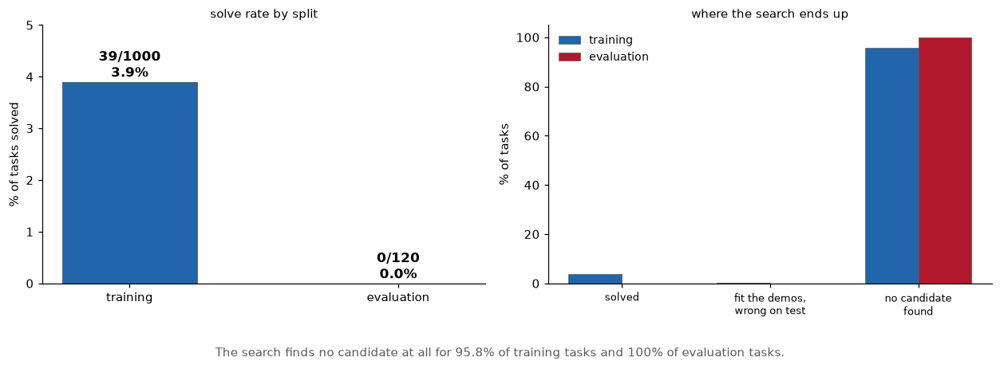
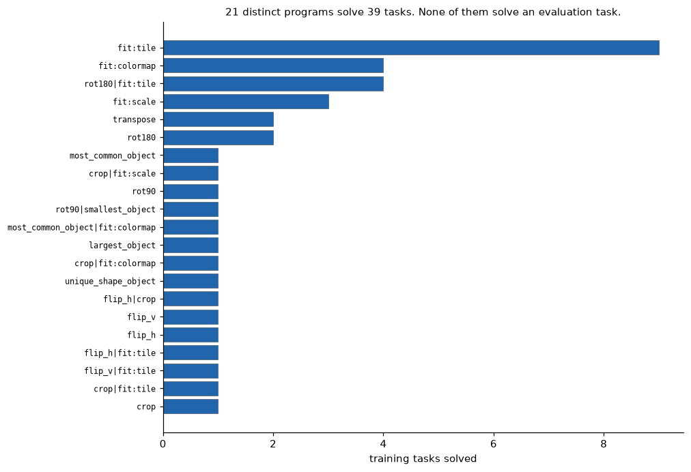
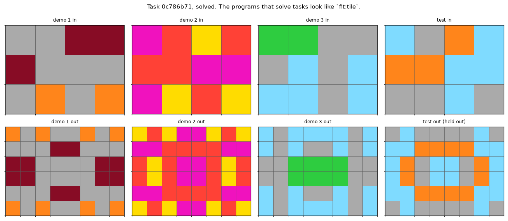

# ARC-AGI-2, a program-synthesis attempt that scores 0.00 on the leaderboard

[](https://github.com/aghasalim/arc-prize-2026/actions/workflows/ci.yml)
[](https://www.python.org/)
[](LICENSE)

An attempt at [ARC Prize 2026 / ARC-AGI-2](https://www.kaggle.com/competitions/arc-prize-2026-arc-agi-2)
by a third-year Applied Computer Science (AI) student. Object-centric DSL with a
verifier-backed program search.

**Results, up front:**

| split | tasks | solved | |
|---|---|---|---|
| public training | 1,000 | **39** | 3.9% |
| **public evaluation** | 120 | **0** | **0.0%** |

Zero. Not a rounding-down of something, the search produced no correct answer
on any of the 120 evaluation tasks, and on 120 of 120 it produced no candidate
program at all, not even a wrong one.

I'm leading with that because the number is the least interesting thing here and
burying it would misrepresent what this is. The grand-prize bar is 85%. A solo
DSL search was never going to approach it, and the useful output of the attempt
is a characterisation of *why* the gap is shaped the way it is.

---


---

## Abstract

ARC-AGI-2 asks for programs that generalise to tasks nobody has seen. This is an
object-centric DSL with a verifier and depth-2 composition, and it is reported as a
failed attempt with the number that makes it one.

The DSL solves 39 of 1,000 training tasks (3.9%) and 0 of 120 evaluation tasks
(0.0%). Zero, not a smaller number. The search finds no candidate at all for 95.8%
of training tasks and 100% of evaluation tasks, so the failure is not a verifier
that rejects good candidates, there are no candidates to reject.

Twenty-one distinct programs account for the 39 training solves, and the shape of
that distribution is the diagnosis: a few broad transforms like`fit:tile` and
`fit:colormap` with a long tail of one-offs. Every one of them was written after
looking at training tasks, which is exactly the generalisation the evaluation split
exists to refuse.

The Kaggle submission scored 0.00, as predicted here before submitting.

**Contributions.** (i) A DSL and verifier reported against the held-out split
rather than the split it was written on. (ii) The candidate-generation failure
isolated from verifier failure. (iii) A predicted score, submitted and confirmed.

---

## 1. What the two splits actually demand

The 3.9%→0% collapse is the finding. It is not sampling noise on 120 tasks, my
solver produced **zero candidate programs** on the eval set, meaning nothing in
its vocabulary fit even the demonstration pairs, let alone the test.

Measured differences between the splits:

| | training | evaluation |
|---|---|---|
| mean input cells | 182 | **373** (2.05×) |
| distinct colours per task | 5.39 | **7.06** |
| demo pairs per task | 3.23 | **2.99** |

Bigger grids, more colours, and *fewer* examples to infer the rule from. That
combination is deliberate: ARC-AGI-2's evaluation set is curated so that tasks
solvable by shallow transformation search are filtered out. My solver is exactly
the thing it was built to exclude, and it behaved accordingly.

**What solved the 39 training tasks**, which shows the ceiling clearly:

| primitive family | tasks |
|---|---|
| tiling (fit:tile, incl. mirrored/composed) | 16 |
| geometric only (rot/flip/transpose) | 7 |
| colour map (fit:colormap) | 6 |
| integer upscale (fit:scale) | 4 |
| object selection | 4 |
| crop to content | 2 |

Every one is a *single global rule* applied to the whole grid. None involves
counting, conditional logic, or a rule that varies per object, which is what
the eval tasks are made of.

---



The right-hand panel matters more than the left. The search fails to produce any
candidate at all for 100% of evaluation tasks, so this is a generation failure
rather than a verification one, there is nothing for the verifier to reject.

## 2. Why program synthesis, and not the GNN I originally wanted

I came in wanting the graph angle, and I split the idea in half rather than
dropping it.

**A GNN as the solver would score ~0**, and not for want of tuning. Each ARC task
defines a *new* rule from 2 to 3 examples. There is no shared function across tasks
to learn weights for; training on the 1,000 training tasks teaches you their
rules, and the eval set deliberately uses different ones. The generalisation
being tested is across *tasks*, not across samples within one, which is the one
thing gradient descent over a fixed weight vector cannot do.

**The object representation survives.** [`grid.py`](arc/grid.py) parses grids
into connected components with colour, bounding box and translation-invariant
normalised shape, and four of the solved tasks are pure object selection. What I
dropped is the learned-weights part, not the structure.

So: objects as the representation, search as the solver, and an exact verifier
as the arbiter. If I extended this, the honest next step is an LLM proposing
candidate programs with this search verifying them, the neural part generates,
the symbolic part checks, and no gradient has to encode a rule it will never see
twice.

---





The second figure is what a solve actually looks like: a mirrored tiling. That is
the scope of this DSL, grid transforms with a fitted tiling or colour map, not
reasoning about objects and goals.

## 3. The verifier, and the number it hides

A candidate is accepted only if it reproduces **every** demo pair exactly. That
is the entire safeguard, and on 2 to 3 examples it is a weak one, a program can
fit all the demos and still be the wrong rule.

`evaluate.py` measures that directly, because the public sets ship test outputs:

| | training |
|---|---|
| solved | 39 |
| **fit every demo, wrong on test** | **3** |
| no candidate found | 958 |

So of 42 tasks where the search *believed* it had the rule, **3 (7%) were
wrong**. Small, but non-zero, and it is the number a leaderboard can never give
back: on Kaggle those three are indistinguishable from the 958 misses.

Two attempts are allowed per task. They bought me **1 task** (38 of 39 solved on
attempt 1), so the Occam-style shortest-program-first ranking is doing nearly all
the work and the second attempt is close to free but nearly worthless here.

---

## 4. Running it

```bash
make setup && make test
```

```bash
make eval-train && make eval
```

Task data is the public [ARC-AGI-2 repo](https://github.com/arcprize/ARC-AGI-2)
(Apache-2.0), vendored under`data/`. No Kaggle credentials needed to reproduce
every number above.

---

## 5. Kaggle submission, scored 0.00, as predicted

**Submitted and scored:`0.00` on the ARC Prize 2026 / ARC-AGI-2 leaderboard**
(submission 55509993, notebook
[ARC-AGI-2 DSL search v2](https://www.kaggle.com/code/aghasalimmustafazada/arc-agi-2-dsl-search)).

The prediction was written into this README *before* submitting, "I would expect
a submitted score at or very near 0%", and the hidden test set returned exactly
that. Small thing, but it is the one calibration check available here: the public
evaluation set was a faithful guide to the private one, so the 0/120 was not an
artefact of that particular 120 tasks.

Mechanics worth recording, since a code competition is not a CSV upload:

- Kaggle re-runs the notebook privately with a hidden test set substituted into
  the competition dataset, then scores the`submission.json` it produces. There
  is no API endpoint for submitting a notebook`kaggle competitions submit -f`
  returns`400` on this competition.
- Version 1 of the kernel died with`FileNotFoundError` because it hardcoded
`/kaggle/input/arc-prize-2026-arc-agi-2/`. The real mount is
`/kaggle/input/competitions/arc-prize-2026-arc-agi-2/`. Version 2 globs for the
  challenges file instead of assuming a path, which is both shorter and correct.
- The hidden set has **240 tasks**, twice the public evaluation set's 120.

One honest weakness in what was submitted:`attempt_2` is identical to
`attempt_1` on every task. When the search finds no candidate it falls back to
echoing the input, and both attempts get that same fallback, so the two-attempt
allowance contributed nothing at all here, rather than merely little.

---

## 6. What I'd do next, honestly

Ordered by expected value, which is not the order of effort:

1. **Stop extending the DSL by hand.** Doubling the search depth is the
   cleanest version of "add more vocabulary", and it moved training from
   **2.7% (depth 1, 27 tasks) to 3.9% (depth 2, 39 tasks)** while leaving eval
   at **0% either way**. The eval tasks need compositional,
   conditional and counting rules; reaching them by enumerating a hand-written
   vocabulary is a losing race against a set curated to defeat it.
2. **LLM-proposes / search-verifies.** The verifier here is the reusable part.
   Published approaches in this range get their leverage from a model
   *generating* candidate programs, not from a bigger primitive set.
3. **Test-time adaptation.** The strongest open results fine-tune per task at
   inference. That fits the benchmark's actual structure, a new rule per
   task, in a way a fixed-weight model does not.

## 7. Licence

MIT. Task data from [ARC-AGI-2](https://github.com/arcprize/ARC-AGI-2) under
Apache-2.0.
