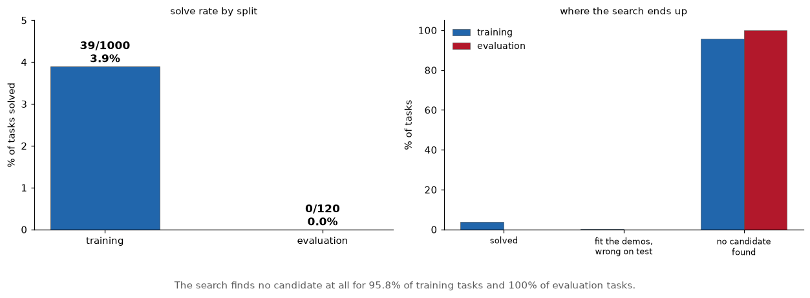
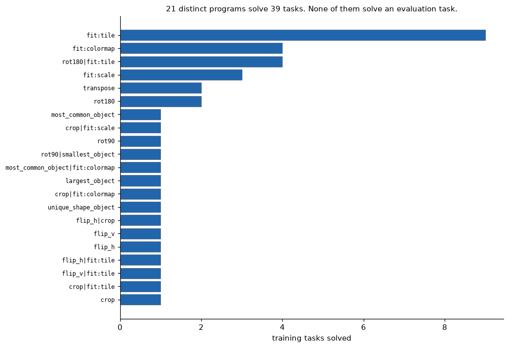
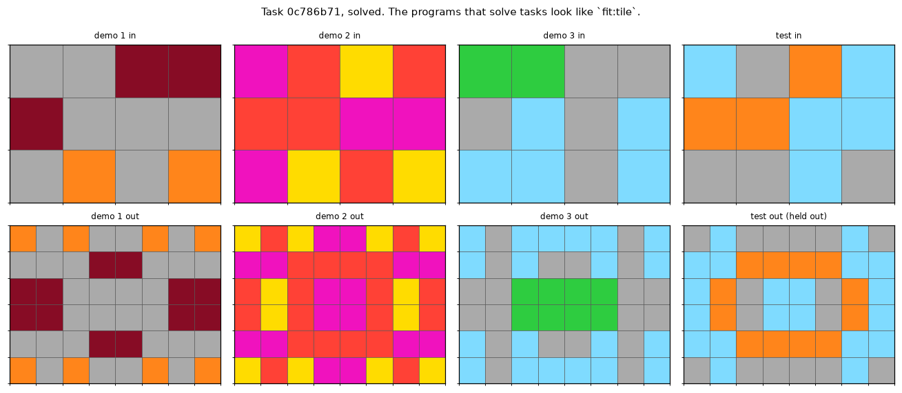

# ARC-AGI-2, a program-synthesis attempt that scores 0.00 on the leaderboard

[](https://github.com/aghasalim/arc-prize-2026/actions/workflows/ci.yml)
[](https://www.python.org/)
[](LICENSE)
[](https://doi.org/10.5281/zenodo.23003614)

An attempt at [ARC Prize 2026 / ARC-AGI-2](https://www.kaggle.com/competitions/arc-prize-2026-arc-agi-2):
an object-centric DSL with a verifier-backed program search, reported as a failed
attempt with the number that makes it one.

**Results, up front:**

| split | tasks | solved | |
|---|---|---|---|
| public training | 1,000 | **39** | 3.9% |
| **public evaluation** | 120 | **0** | **0.0%** |

Zero. Not a rounding-down of something, the search produced no correct answer
on any of the 120 evaluation tasks, and on 120 of 120 it produced no candidate
program at all, not even a wrong one.

I'm leading with that because the number is the least interesting thing here and
burying it would misrepresent what this is. The grand-prize bar is 85%. A solo
DSL search was never going to approach it, and the useful output of the attempt
is a characterisation of *why* the gap is shaped the way it is.

The rest of this page is that characterisation, roughly in the order I worked it
out.

---

## The 3.9% → 0% collapse is not sampling noise

It is not sampling noise on 120 tasks, my solver produced **zero candidate
programs** on the eval set, meaning nothing in its vocabulary fit even the
demonstration pairs, let alone the test. The search finds no candidate at all for
95.8% of training tasks and 100% of evaluation tasks, so the failure is not a
verifier that rejects good candidates: there are no candidates to reject.

Measured differences between the splits:

| | training | evaluation |
|---|---|---|
| mean input cells | 182 | **373** (2.05×) |
| distinct colours per task | 5.39 | **7.06** |
| demo pairs per task | 3.23 | **2.99** |

Those three rows come from [`scripts/split_stats.py`](scripts/split_stats.py),
which writes one row per task to `reports/task_stats.csv` and the summary above
to `reports/split_stats.csv`.

Bigger grids, more colours, and *fewer* examples to infer the rule from. That
combination is deliberate: ARC-AGI-2's evaluation set is curated so that tasks
solvable by shallow transformation search are filtered out. My solver is exactly
the thing it was built to exclude, and it behaved accordingly.



The right-hand panel matters more than the left. The search fails to produce any
candidate at all for 100% of evaluation tasks, so this is a generation failure: there is nothing for the verifier to reject.

## Twenty-one programs, and the ceiling they draw

Twenty-one distinct programs account for the 39 training solves, and the shape of
that distribution is the diagnosis: a few broad transforms with a long tail of
one-offs. Every one of them was written after looking at training tasks, which is
exactly the generalisation the evaluation split exists to refuse.

**What solved the 39 training tasks:**

| primitive family | tasks |
|---|---|
| tiling (fit:tile, incl. mirrored/composed) | 16 |
| geometric only (rot/flip/transpose) | 7 |
| colour map (fit:colormap) | 6 |
| integer upscale (fit:scale) | 4 |
| object selection | 4 |
| crop to content | 2 |

Every one is a *single global rule* applied to the whole grid. None involves
counting, conditional logic, or a rule that varies per object, which is what
the eval tasks are made of.




## The verifier is weaker than it looks, and Kaggle hides that

A candidate is accepted only if it reproduces **every** demo pair exactly. On 2
or 3 demos that is a weak guarantee, and `evaluate.py` measures how weak: of the
42 training tasks where the search believed it had the rule, 3 fit every demo and
still got the test grid wrong. That is 7%, and it is the number a leaderboard can
never give back, because on Kaggle those 3 are indistinguishable from the 958
tasks that produced no candidate at all. The second allowed attempt bought 1
task, since 38 of the 39 were already solved on attempt 1.

Full working: [notes/METHODS.md](notes/METHODS.md#3-the-verifier-and-the-number-it-hides).

## The GNN I came in wanting, and the half of it that survived

I came in wanting the graph angle, and I split the idea in half to keep it.

A GNN as the solver would score about 0, and no amount of tuning fixes that. Each
ARC task defines a new rule from 2 or 3 examples, so there is no function shared
across tasks for gradient descent to fit weights to. What survived is the object
representation: `grid.py` parses every grid into connected components, and 4 of
the 39 training solves are object selection. I dropped the learned weights and kept the structure.

Full working: [notes/METHODS.md](notes/METHODS.md#2-why-program-synthesis-and-not-the-gnn-i-originally-wanted).

## The submission, predicted before it was scored

**Submitted and scored: `0.00` on the ARC Prize 2026 / ARC-AGI-2 leaderboard** (submission 55509993, notebook [ARC-AGI-2 DSL search v2](https://www.kaggle.com/code/aghasalimmustafazada/arc-agi-2-dsl-search)).

The prediction went into this README before I submitted, that I expected a score
at or very near 0%, and the hidden test set returned it. That hidden set holds
240 tasks, twice the 120 in the public evaluation split, so the 0 of 120 was not
an artefact of which 120 tasks I happened to have. One weakness in what went up:
`attempt_2` is identical to `attempt_1` on every task, because the no-candidate
fallback echoes the input into both, so the two-attempt allowance contributed
nothing at all.

Full working: [notes/METHODS.md](notes/METHODS.md#5-kaggle-submission-scored-000-as-predicted).

---

## Running the whole thing yourself

```bash
make setup && make test
```

```bash
make eval-train && make eval
```

Task data is the public [ARC-AGI-2 repo](https://github.com/arcprize/ARC-AGI-2)
(Apache-2.0), vendored under `data/`. No Kaggle credentials needed to reproduce
every number above. Those numbers are also rebuilt from the raw task files by the
independent implementations in `verify/`, and CI fails the build if any of them
disagrees.

## Three next moves, by expected value rather than effort

1. **Stop extending the DSL by hand.** Doubling the search depth is the cleanest
   version of adding vocabulary, and it moved training from 2.7% (27 tasks at
   depth 1) to 3.9% (39 tasks at depth 2) while leaving evaluation at 0% either
   way. Hand-written primitives buy less than that per hour spent.
2. **Have an LLM propose candidate programs and keep this search as the checker.**
   The verifier is the reusable half of what I built.
3. **Test-time adaptation**, which fits a benchmark whose whole structure is a new
   rule per task.

Full working: [notes/METHODS.md](notes/METHODS.md#6-what-id-do-next-honestly).

MIT licensed. Task data from [ARC-AGI-2](https://github.com/arcprize/ARC-AGI-2)
under Apache-2.0.

## Reading behind this

- **Chollet. On the Measure of Intelligence. 2019.** [arXiv:1911.01547](https://arxiv.org/abs/1911.01547) ARC and the skill acquisition efficiency argument behind it.
- **Chollet, Knoop, Kamradt, Landers, Pinkard. ARC-AGI-2: A New Challenge for Frontier AI Reasoning Systems. 2025.** [arXiv:2505.11831](https://arxiv.org/abs/2505.11831) the benchmark this targets.
